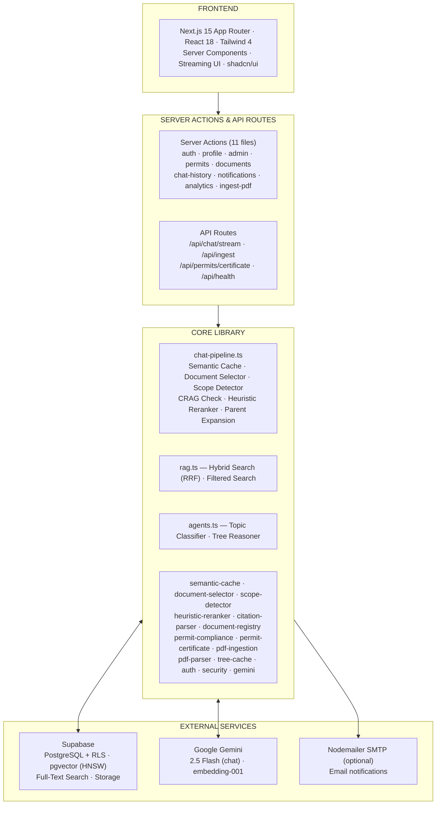
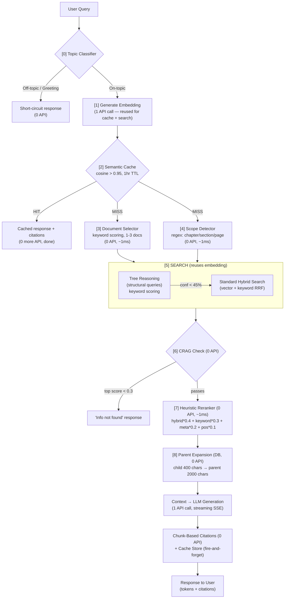
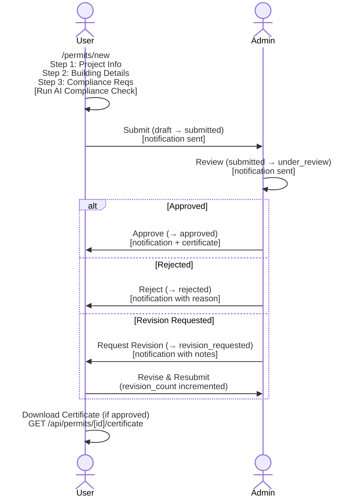
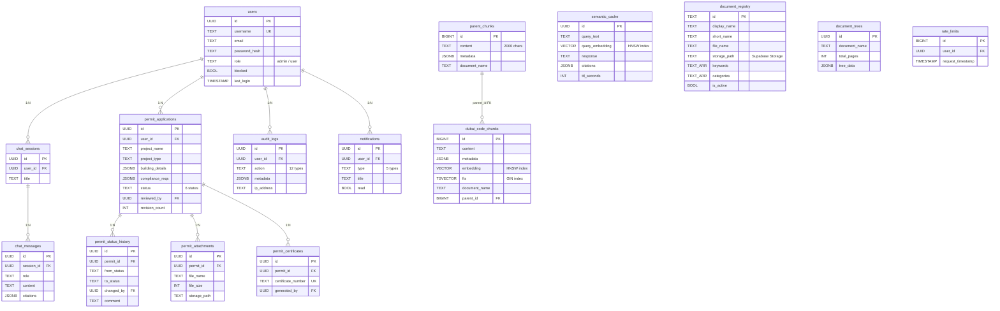

<div align="center">


# PermitForge

### AI-Powered Building Code Compliance Assistant

<br />

[](https://nextjs.org/)
[](https://www.typescriptlang.org/)
[](https://ai.google.dev/)
[](https://supabase.com/)
[](https://react.dev/)
[](https://tailwindcss.com/)
[](https://zod.dev/)
[](./test)
[](./LICENSE)

<br />

[**Features**](#-features) · [**Quick Start**](#-quick-start) · [**Architecture**](#-architecture) · [**API**](#-api-reference) · [**Permits**](#-permit-system) · [**Testing**](#-testing) · [**Tech Stack**](#-tech-stack)

<br />

</div>

---

## Overview

**PermitForge** is an enterprise-grade AI assistant for building code compliance. It combines two major subsystems:

1. **Hybrid RAG Chat Pipeline** — optimized to **1-2 API calls per question** (~1.5 average with semantic caching). Uses vector + keyword hybrid search with RRF, deterministic Tree Reasoning, heuristic reranking, parent-child chunking, and chunk-based citations across **dynamically managed documents**.
2. **Permit Application System** — full lifecycle permit management with AI-powered compliance checks, multi-step forms, file attachments, admin review workflow, and PDF certificate generation.

> **Who is it for?** — Architects, engineers, construction professionals, and regulatory consultants working with building codes.

<br />

## Features

<table>
<tr>
<td width="50%">

### Streaming AI Chat
- **Gemini 2.5 Flash** via LangChain streaming
- Context-aware conversation memory (last 10 messages)
- Multilingual — English, Russian, Arabic
- Real-time token-by-token SSE responses
- Chat session management with history sidebar
- Chat export to Markdown

</td>
<td width="50%">

### Hybrid RAG Pipeline
- **1-2 API calls** per question
- **Semantic cache** — cosine similarity > 0.95, 1hr TTL, 30-40% hit rate, de-duplicated by `md5(query_text)` unique index (no concurrent-insert bloat)
- **Vector similarity** (0.7) + **keyword FTS** (0.3) via RRF
- **CRAG check** — pre-generation quality gate (threshold 0.3)
- **Heuristic reranker** — deterministic scoring, 0 API, ~1ms
- **Parent-child chunking** — 400-char search precision, 2000-char LLM context
- **Document selector** — keyword-based routing to 1-3 documents (0 API)
- **Pipeline resilience (v1.3.0):** 30 s hard timeout via `Promise.race`, per-run `AbortController` plumbed through embeddings + LangChain streaming, singleflight cap of 100 concurrent distinct queries, cache writes gated on response length ≥ 50 chars and signal-not-aborted (no truncated-answer poisoning)

</td>
</tr>
<tr>
<td>

### Tree Reasoning
- **Deterministic** keyword-scoring algorithm (no LLM call)
- Structure-aware search using document hierarchy & TOC
- Regex-based query classifier (~1 ms)
- Automatic fallback to standard RAG if confidence < 45%
- Two-tier cache (in-memory L1 5-min TTL + Supabase L2)

</td>
<td>

### Chunk-Based Citations
- Citations from **DB metadata** — 100% accurate, 0 API calls
- No LLM parsing needed — each chunk has exact page, section, document info
- Top 5-7 chunks after reranking become the sources
- Confidence scoring from search relevance scores
- Document attribution across all registered documents
- System prompt instructs LLM: "Sources are displayed separately"

</td>
</tr>
<tr>
<td>

### Permit Application System
- **6-status lifecycle:** draft → submitted → under_review → approved / rejected / revision_requested
- **3-step multi-step form:** project info → building details → compliance requirements
- **AI compliance check** — queries RAG → feeds context to Gemini → returns structured JSON analysis
- **File attachments** — up to 10 files, 10 MB each (PDF, PNG, JPG, DWG, DXF)
- **PDF certificate generation** — `PF-CERT-{YEAR}-{ID}` format via PDFKit
- **Status timeline** tracking with full admin review interface
- **Revision workflow** — admins can request revisions; users resubmit with incremented count
- **In-app + email notifications** via Nodemailer (SMTP) on every status change

</td>
<td>

### Enterprise Security
- **JWT** (HS256, 7-day expiry) with HttpOnly cookies
- **bcrypt** (12 rounds) password hashing
- **Timing-safe CSRF** token validation
- **Rate limiting** — database-backed for all endpoints (API: per-user 10 req/min via `rate_limits` table; login: per-IP via `ip_rate_limits` table)
- **Zod v4** schema validation on all inputs
- **Output escaping** — HTML-escaped user data in email templates
- **RLS** — PostgreSQL Row-Level Security on all 16 tables
- **Real-time block check** in Edge middleware (5-min cache)
- Security headers: `X-Frame-Options`, `X-Content-Type-Options`, `X-XSS-Protection`, `Referrer-Policy`, `Permissions-Policy`

</td>
</tr>
<tr>
<td>

### Admin Dashboard
- **5-tab panel:** Overview · Users · Permits · Documents · Audit Logs
- User CRUD with block/unblock & role management
- Permit review with approve / reject / request revision workflow
- **Dynamic document management** — register, edit, ingest, delete documents
- Real-time analytics: active users, total queries, permit stats
- Weekly activity charts, document usage, top users, permit status breakdown (Recharts)
- Full audit log history (12 event types tracked)
- Health check endpoint for monitoring

</td>
<td>

### PDF Ingestion & Dynamic Documents
- **PDF.js**-based parsing with TOC/bookmark extraction
- **Parent-child chunking** — child (400 chars) for search, parent (2000 chars) for LLM context
- Section hierarchy mapping & content type detection
- Automatic document tree generation for Tree Reasoning
- Batch embedding via `gemini-embedding-001` (768-dim, rate-limit-aware)
- Resume support — skips already-ingested chunks
- **Dynamic document registry** — upload & add any PDF via admin panel (Supabase Storage)
- Fully dynamic — admin can upload, add/remove any documents
- **Auto-keyword extraction** from PDF text via TF-IDF during ingestion (0 API calls)
- Per-document stats, re-ingestion, deactivation/restore

</td>
</tr>
<tr>
<td>

### Notification System
- In-app notifications with unread badges
- Email notifications via Nodemailer SMTP (optional)
- 5 notification types: permit submitted, under review, approved, rejected, revision requested
- Branded HTML email templates with status indicators
- Silent failure handling — never breaks calling action

</td>
<td>

### Modern UI
- Dark / Light theme with system preference detection
- **shadcn/ui** + **Radix UI** component library
- Markdown rendering with formatted tables & lists
- Interactive citation badges with page links
- Responsive sidebar with chat history management
- Multi-step permit form with stepper navigation
- Real-time compliance check results panel

</td>
</tr>
<tr>
<td colspan="2">

### Localization (i18n)
- **3 languages** — English (default), Русский, Қазақша — `react-i18next` + bundled JSON dictionaries
- **Language switcher** next to the theme toggle in every header (dashboard, auth pages, admin)
- User preference persisted in `localStorage['pf-locale']`; first-time visitors auto-detected from `navigator.language`
- **Hydration-safe init** — SSR + first client render pinned to English, locale switch fires post-mount so React's hydration validator never sees a mismatch (resolves React error #418)
- Locale-aware date/time formatting via `Intl.RelativeTimeFormat` / `Intl.DateTimeFormat` (timestamps, "3 days ago" / "3 күн бұрын")
- `<html lang="...">` kept in sync with the active locale for screen readers and search engines

</td>
</tr>
</table>

<br />

---

## Quick Start

### Prerequisites

| Tool | Version | Link |
|------|---------|------|
| Node.js | >= 20.x | [nodejs.org](https://nodejs.org/) |
| npm | >= 10.x | Included with Node.js |
| Supabase Account | — | [supabase.com](https://supabase.com/) |
| Google AI API Key | — | [ai.google.dev](https://ai.google.dev/) |

### 1. Clone & Install

```bash
git clone https://github.com/MakazhanAlpamys/Permit-Forge.git
cd Permit-Forge
npm install
```

### 2. Configure Environment

Create `.env.local` in the project root:

```env
# Supabase
NEXT_PUBLIC_SUPABASE_URL=https://your-project.supabase.co
SUPABASE_ANON_KEY=your_anon_key
SUPABASE_SERVICE_ROLE_KEY=your_service_role_key

# Google Gemini
GEMINI_API_KEY=your_gemini_api_key

# JWT (min 32 chars, 64+ recommended)
JWT_SECRET=your_secure_random_jwt_secret

# Optional — Email via Nodemailer (Gmail SMTP)
SMTP_HOST=smtp.gmail.com                 # SMTP server host
SMTP_PORT=587                            # SMTP port (587 for TLS, 465 for SSL)
SMTP_USER=your_gmail@gmail.com           # Gmail address
SMTP_PASS=your_app_password              # Gmail App Password (16 chars)
LOG_LEVEL=info                           # debug | info | warn | error
```

> Never commit `.env.local` to version control.

### 3. Set Up Database

1. Create a project in [Supabase Dashboard](https://supabase.com/dashboard)
2. Open **SQL Editor** and run `supabase/migrations/000_full_setup.sql`

This single idempotent script drops and recreates the entire schema: **16 tables**, **38 RPC functions**, HNSW vector indexes, GIN full-text search, and RLS policies. Seeds an admin user.

Default admin credentials: `admin` / `Admin123!`

### 4. Run

```bash
# Development
npm run dev

# Production
npm run build && npm start
```

Open [http://localhost:3000](http://localhost:3000)

### 5. First-Time Setup

1. **Login** at `/login` — `admin` / `Admin123!`
2. **Change the default password** immediately (Admin Panel → Users)
3. **Ingest PDFs** — Admin Panel → Documents → Add Document → upload PDF → click Ingest
4. **Create users** — Admin Panel → Users → Create User
5. **Start chatting** — return to dashboard and ask questions about building codes

<br />

---

## Architecture

### System Overview



### RAG Pipeline Flow



**API calls per scenario:**

| Scenario | Embedding | LLM | Total |
|----------|:---------:|:---:|:-----:|
| Cache hit | 1 | 0 | **1** |
| Greeting (regex) | 0 | 0 | **0** |
| Greeting (LLM fallback) | 0 | 1 | **1** |
| Weak search (CRAG fails) | 1 | 0 | **1** |
| Full pipeline | 1 | 1 | **2** |
| **Average (with cache)** | ~0.8 | ~0.7 | **~1.5** |

### Permit Lifecycle



### Database Schema



**16 tables** · 38 RPC functions · Row-Level Security on all tables · HNSW vector indexes (m=16, ef_construction=64) · GIN full-text search · B-tree indexes on metadata fields

<br />

---

## API Reference

### API Routes

| Method | Endpoint | Auth | Description |
|--------|----------|------|-------------|
| `POST` | `/api/chat/stream` | User | SSE streaming chat — tokens + citations |
| `GET` | `/api/chat/export?sessionId=uuid` | User | Export chat session as Markdown file |
| `POST` | `/api/ingest` | Admin | PDF ingestion with SSE progress streaming |
| `GET` | `/api/permits/[id]/certificate` | User | Download approved permit PDF certificate |
| `GET` | `/api/health` | Public | Health check — env vars + DB connectivity |

### Streaming Chat — `POST /api/chat/stream`

```http
POST /api/chat/stream
Content-Type: application/json
Cookie: ef_token=<jwt>
X-CSRF-Token: <csrf_token>

{
  "message": "What are parking requirements for residential buildings?",
  "sessionId": "optional-uuid"
}
```

**Response** (`text/plain`, streamed):

```
According to Section 5.2 of the Building Code...

[tokens stream in real-time]

__CITATIONS__[{"chunkId":123,"page":45,"section":"5.2","documentName":"building-code-2021",...}]
```

### PDF Ingestion — `POST /api/ingest`

```http
POST /api/ingest
Content-Type: application/json
Cookie: ef_token=<admin-jwt>

{ "documentId": "building-code-2021" }
```

**Response** (`text/event-stream`):

```
data: {"stage":"parsing","progress":5,"total":100,"message":"Parsing PDF..."}
data: {"stage":"embedding","progress":50,"total":100,"message":"Generating embeddings...","chunksProcessed":250}
data: {"stage":"complete","progress":100,"total":100,"done":true,"chunksProcessed":1250}
```

### Server Actions

| Action | File | Description |
|--------|------|-------------|
| `loginAction()` | `actions/auth.ts` | Authenticate user, set JWT + CSRF cookies |
| `logoutAction()` | `actions/auth.ts` | Destroy session cookies, audit log |
| `getCSRFTokenAction()` | `actions/auth.ts` | Get current CSRF token |
| `registerAction()` | `actions/auth.ts` | Self-registration with email verification |
| `verifyEmailAction()` | `actions/auth.ts` | Verify email with 6-digit code |
| `forgotPasswordAction()` | `actions/auth.ts` | Send password reset code to email |
| `resetPasswordAction()` | `actions/auth.ts` | Reset password with code verification |
| `getProfileAction()` | `actions/profile.ts` | Get user profile data |
| `updateProfileAction()` | `actions/profile.ts` | Update username, full name |
| `requestPasswordChangeCodeAction()` | `actions/profile.ts` | Send password change code to email |
| `confirmPasswordChangeAction()` | `actions/profile.ts` | Confirm password change with code |
| `adminChangePasswordAction()` | `actions/profile.ts` | Admin direct password change (no code) |
| `createChatSession()` | `actions/chat-history.ts` | Create a new chat session |
| `getChatSessions()` | `actions/chat-history.ts` | List user's sessions |
| `getSessionMessages()` | `actions/chat-history.ts` | Fetch messages with citations |
| `deleteChatSession()` | `actions/chat-history.ts` | Delete with ownership check |
| `createPermit()` | `actions/permits.ts` | Create draft permit (step 1) |
| `updatePermitBuildingDetails()` | `actions/permits.ts` | Update building details (step 2) |
| `updatePermitComplianceRequirements()` | `actions/permits.ts` | Set compliance requirements (step 3) |
| `submitPermit()` | `actions/permits.ts` | Submit permit for review |
| `runComplianceCheck()` | `actions/permits.ts` | Trigger AI compliance analysis |
| `revisePermit()` | `actions/permits.ts` | Reset permit to draft for revision |
| `getMyPermits()` | `actions/permits.ts` | List user's permits |
| `getPermitById()` | `actions/permits.ts` | Fetch single permit (role-aware) |
| `getPermitHistory()` | `actions/permits.ts` | Status change timeline |
| `deletePermit()` | `actions/permits.ts` | Delete draft permit + attachments |
| `uploadPermitAttachment()` | `actions/permit-attachments.ts` | Upload file (max 10/permit, 10MB) |
| `deletePermitAttachment()` | `actions/permit-attachments.ts` | Remove attachment from storage |
| `getPermitAttachments()` | `actions/permit-attachments.ts` | List attachments with signed URLs |
| `getAdminPermits()` | `actions/admin-permits.ts` | All permits (filterable, paginated) |
| `reviewPermit()` | `actions/admin-permits.ts` | Approve / reject / request revision |
| `setPermitUnderReview()` | `actions/admin-permits.ts` | Start review (submitted → under_review) |
| `getPermitStats()` | `actions/admin-permits.ts` | Permit counts by status |
| `getAllRegisteredDocuments()` | `actions/documents.ts` | List all documents from registry |
| `upsertDocument()` | `actions/documents.ts` | Add or update document metadata |
| `deleteDocument()` | `actions/documents.ts` | Soft-delete document (optional chunk purge) |
| `uploadDocumentPDF()` | `actions/documents.ts` | Upload PDF to Supabase Storage |
| `restoreDocument()` | `actions/documents.ts` | Re-activate deleted document |
| `getNotifications()` | `actions/notifications.ts` | User's notifications + unread count |
| `markNotificationRead()` | `actions/notifications.ts` | Mark single notification as read |
| `markAllNotificationsRead()` | `actions/notifications.ts` | Mark all notifications as read |
| `getAnalyticsDashboardStats()` | `actions/analytics.ts` | Admin dashboard statistics |
| `getMessageActivity30d()` | `actions/analytics.ts` | 30-day message activity chart data |
| `getDocumentUsageStats()` | `actions/analytics.ts` | Document chunk usage breakdown |
| `getPermitStatusBreakdown()` | `actions/analytics.ts` | Permit status distribution |
| `getTopActiveUsers()` | `actions/analytics.ts` | Most active users leaderboard |
| `getAllUsers()` | `actions/admin.ts` | List all users (admin) |
| `adminCreateUser()` | `actions/admin.ts` | Create user (admin) |
| `blockUser()` | `actions/admin.ts` | Block/unblock user (admin) |
| `adminDeleteUser()` | `actions/admin.ts` | Delete user (admin) |
| `adminResetPassword()` | `actions/admin.ts` | Reset user password (admin) |
| `getAuditLogs()` | `actions/admin.ts` | View audit trail (admin) |
| `ingestPDF()` | `actions/ingest-pdf.ts` | Trigger PDF ingestion (admin) |
| `getIngestionStatus()` | `actions/ingest-pdf.ts` | Check chunk count & status |

<br />

---

## Permit System

### Lifecycle

| Status | Description | Set by |
|--------|-------------|--------|
| `draft` | Initial creation, editable | User |
| `submitted` | Sent for review | User |
| `under_review` | Admin actively reviewing | Admin |
| `approved` | Permit granted, certificate available | Admin |
| `rejected` | Permit denied with reason | Admin |
| `revision_requested` | Changes needed, user can revise and resubmit | Admin |

### Multi-Step Application Form

1. **Project Info** — name, description, location, project type (residential / commercial / industrial / mixed_use / institutional)
2. **Building Details** — floors, built-up area, plot area, height, units, parking spaces, occupancy type, construction type
3. **Compliance Requirements** — fire safety, accessibility, parking compliance, structural safety, MEP systems, energy efficiency, additional notes

### AI Compliance Check

When triggered by the user (`runComplianceCheck`):
1. Generates targeted RAG search queries from building details
2. Runs parallel hybrid searches (up to 15 unique chunks)
3. Sends context + permit summary to Gemini for structured JSON analysis
4. Returns `overallStatus` (compliant / non_compliant / requires_review) with individual checks and code references
5. Graceful fallback to `requires_review` on AI failure

### File Attachments

- Max 10 files per permit, 10 MB each
- Allowed types: `.pdf`, `.png`, `.jpg`, `.jpeg`, `.dwg`, `.dxf`
- Stored in Supabase Storage bucket `permit-attachments`
- 1-hour signed URLs for downloads

### PDF Certificates

Generated for approved permits via `GET /api/permits/[id]/certificate`:
- A4 PDF via `PDFKit`
- Certificate number: `PF-CERT-{YEAR}-{8-char-ID}`
- Includes project info, building details, approval status, review comments

### Pages

| Route | Access | Purpose |
|-------|--------|---------|
| `/permits` | User | Permit list with status badges |
| `/permits/new` | User | Multi-step creation form |
| `/permits/[id]` | User | Permit detail — timeline, attachments, compliance results |

<br />

---

## Testing

**1202 tests** across **73 test suites** with ~72.1% line / ~60.3% branch coverage of `lib/`, `actions/`, `components/`, and `app/api/` (v1.10.0).

```bash
npm test              # Run all tests (watch mode)
npm run test:coverage # v8 coverage report (HTML)
npm run test:ui       # Vitest UI dashboard
```

Single file: `npx vitest run test/auth.test.ts`
Pattern match: `npx vitest run -t "pattern"`

> **Note:** On Windows, use `--pool forks` for reliability.

| Suite | File | Tests | Covers |
|-------|------|:-----:|--------|
| **Auth** | `test/auth.test.ts` | 8 | JWT create/verify, CSRF tokens, password hashing |
| **Auth Actions** | `test/auth-actions.test.ts` | 21 | Login, register, verify email, forgot/reset password |
| **Profile Actions** | `test/profile-actions.test.ts` | 25 | Profile CRUD, email-code-based password change |
| **Agents** | `test/agents.test.ts` | 20 | Topic classification, query structure, tree reasoning |
| **Admin** | `test/admin.test.ts` | 21 | User creation, password rules, admin operations |
| **Admin Actions** | `test/admin-actions.test.ts` | 45 | 7 admin functions: create, block, delete, reset |
| **Admin Permits** | `test/admin-permits-actions.test.ts` | 31 | Permit review and approval workflow |
| **Analytics** | `test/analytics-actions.test.ts` | 21 | 5 stats endpoints: dashboard, activity, usage |
| **API Chat Stream** | `test/api-chat-stream.test.ts` | 9 | Auth (401), rate limit (429), validation (400), CSRF, streaming (200) |
| **API Routes** | `test/api-routes.test.ts` | 10 | Health, chat export, permit certificate endpoints |
| **Chat History** | `test/chat-history.test.ts` | 30 | Session CRUD, message loading, search |
| **Chat Pipeline** | `test/chat-pipeline.test.ts` | 7 | RAG pipeline, semantic cache, CRAG, citation generation |
| **Citations** | `test/citation-parser.test.ts` | 14 | Chunk-based citations, confidence scoring, stats |
| **Documents** | `test/documents-actions.test.ts` | 26 | Document registry CRUD, PDF upload |
| **Email** | `test/email.test.ts` | 18 | Nodemailer SMTP, code generation, HTML templates |
| **Lib Modules** | `test/lib-modules.test.ts` | 42 | Security guards, file-upload, reranker, scope-detector |
| **Notifications** | `test/notifications-actions.test.ts` | 13 | Read/mark notifications |
| **Permit Attachments** | `test/permit-attachments.test.ts` | 19 | File upload/delete |
| **Permit Compliance** | `test/permit-compliance.test.ts` | 6 | AI compliance check, error fallback, malformed JSON handling |
| **Permit Actions** | `test/permits-actions.test.ts` | 18 | Create, submit, list, get, delete permits |
| **Permits Extended** | `test/permits-actions-extended.test.ts` | 28 | Building details, compliance, revise & resubmit |
| **RAG** | `test/rag.test.ts` | 8 | Hybrid search with pre-computed embeddings, document filter |
| **Tree Reasoning** | `test/tree-reasoning.test.ts` | 28 | Query structure classification, keyword scoring, page ranges |
| **Validations** | `test/validations.test.ts` | 17 | Zod schemas, sanitization, edge cases |
| **Validations New** | `test/validations-new.test.ts` | 81 | 10 additional Zod schemas for all input types |

Test setup (`test/setup.ts`) mocks Supabase clients, Next.js headers/cookies, and 6 environment variables.

<br />

---

## Project Structure

```
PermitForge/
├── actions/                           # Server Actions (11 files)
│   ├── auth.ts                        #   Login, logout, register, verify email, forgot/reset password
│   ├── profile.ts                     #   Profile CRUD, password change via email code
│   ├── admin.ts                       #   User CRUD, stats, audit logs
│   ├── admin-permits.ts               #   Permit review & approval workflow
│   ├── permits.ts                     #   Permit CRUD, submit, compliance check
│   ├── permit-attachments.ts          #   File upload, download, delete
│   ├── chat-history.ts                #   Session & message management
│   ├── documents.ts                   #   Document registry CRUD (add, edit, delete, restore)
│   ├── notifications.ts               #   Notification read/unread management
│   ├── analytics.ts                   #   Dashboard charts & statistics
│   └── ingest-pdf.ts                  #   PDF ingestion trigger + status
│
├── app/                               # Next.js App Router
│   ├── layout.tsx                     #   Root layout + theme + metadata
│   ├── page.tsx                       #   Main chat dashboard
│   ├── globals.css                    #   Global styles
│   ├── login/page.tsx                 #   Login page
│   ├── register/page.tsx              #   Self-registration page
│   ├── verify-email/page.tsx          #   Email verification (6-digit code)
│   ├── forgot-password/page.tsx       #   Multi-step password reset
│   ├── profile/page.tsx               #   Profile management
│   ├── admin/page.tsx                 #   Admin panel (5 tabs)
│   ├── not-found.tsx                  #   Custom 404 page
│   ├── permits/
│   │   ├── page.tsx                   #   Permit list
│   │   ├── new/page.tsx               #   Multi-step permit form (3 steps)
│   │   └── [id]/page.tsx              #   Permit detail view
│   └── api/
│       ├── chat/stream/route.ts       #   SSE streaming chat
│       ├── chat/export/route.ts       #   Chat export to Markdown
│       ├── ingest/route.ts            #   SSE PDF ingestion
│       ├── permits/[id]/certificate/  #   PDF certificate generation
│       └── health/route.ts            #   Health check endpoint
│
├── components/
│   ├── theme-provider.tsx             #   Dark/light theme context
│   ├── theme-toggle.tsx               #   Theme switcher
│   ├── i18n-provider.tsx              #   i18next provider + post-mount locale sync
│   ├── language-toggle.tsx            #   Language switcher (EN/RU/KK) next to ThemeToggle
│   ├── chat/                          #   ChatInterface, MessageBubble, SourceCitation
│   ├── admin/                         #   UserManagement, CreateUserDialog, DocumentManagement,
│   │                                  #   PdfIngestionTab, PermitManagement, AuditLogs,
│   │                                  #   EnhancedStatsCards, Charts (3 chart components),
│   │                                  #   TopUsersTable
│   ├── dashboard/                     #   Header, Sidebar
│   ├── login/                         #   DitheringBackground
│   ├── notifications/                 #   NotificationBell
│   ├── permits/                       #   FormStep1-3, Stepper, PermitCard, PermitList,
│   │                                  #   PermitDetail, CompliancePanel, FileUploadZone,
│   │                                  #   StatusBadge, StatusTimeline, AttachmentList
│   └── ui/                            #   shadcn/ui primitives (9 components)
│
├── lib/                               # Core Business Logic (27 modules)
│   ├── chat-pipeline.ts               #   RAG orchestration + feature flags
│   ├── rag.ts                         #   Hybrid search, CRAG check, parent expansion
│   ├── agents.ts                      #   Topic classifier + Tree Reasoner
│   ├── semantic-cache.ts              #   Semantic query caching via pgvector
│   ├── document-selector.ts           #   Keyword-based document scoring (0 API)
│   ├── scope-detector.ts              #   Regex page/section/chapter detection (0 API)
│   ├── heuristic-reranker.ts          #   Deterministic reranking (0 API, ~1ms)
│   ├── citation-parser.ts             #   Chunk-based citations (0 API, 100% accurate)
│   ├── keyword-extractor.ts           #   TF-IDF keyword extraction from PDF (0 API)
│   ├── document-registry.ts           #   Document registry (fully DB-driven, cached)
│   ├── auth.ts                        #   JWT, sessions, passwords, CSRF
│   ├── security.ts                    #   requireAuth / requireAdmin guards
│   ├── gemini.ts                      #   Gemini + LangChain configuration
│   ├── email.ts                       #   Email via Nodemailer SMTP: verification, reset, password change
│   ├── pdf-parser.ts                  #   PDF.js text & TOC extraction
│   ├── pdf-ingestion.ts               #   Parent-child chunking, embedding, tree building
│   ├── tree-cache.ts                  #   Two-tier document tree cache
│   ├── permit-compliance.ts           #   RAG-powered compliance analysis
│   ├── permit-certificate.ts          #   PDF certificate via PDFKit
│   ├── notifications.ts               #   In-app + email (Nodemailer SMTP) notifications
│   ├── file-upload.ts                 #   File validation, storage path generation
│   ├── transforms.ts                  #   Shared data transforms (permit row → TS object)
│   ├── supabase-server.ts             #   Supabase client factory (anon + admin)
│   ├── validations.ts                 #   Zod v4 schemas for all inputs
│   ├── constants.ts                   #   App-wide constants & configuration
│   ├── logger.ts                      #   Centralized logging (LOG_LEVEL support)
│   ├── utils.ts                       #   Utilities (cn, etc.)
│   └── i18n/
│       ├── config.ts                  #   Supported locales + storage key + label maps
│       ├── client.ts                  #   i18next init pinned to DEFAULT_LOCALE (hydration-safe)
│       └── locales/{en,ru,kk}.json    #   Bundled translation dictionaries
│
├── types/index.ts                     # Shared TypeScript definitions
├── test/                              # Vitest test suites (73 files, 1202 tests)
├── supabase/migrations/               # Database schema (single 000_full_setup.sql)
├── middleware.ts                       # Edge auth + block check + security headers
└── public/                            # Static assets
```

<br />

---

## Routes

| Route | Access | Purpose |
|-------|--------|---------|
| `/` | User | Main dashboard — chat interface + sidebar with session history |
| `/login` | Public | Login page (redirects logged-in users by role) |
| `/register` | Public | Self-registration with email verification |
| `/verify-email` | Public | 6-digit code entry to verify email after registration |
| `/forgot-password` | Public | Multi-step password reset (email → code → new password) |
| `/profile` | User | Profile management — edit username/name, email-code-based password change |
| `/permits` | User | Permit application list |
| `/permits/new` | User | Multi-step permit creation (3 steps: project → building → compliance) |
| `/permits/[id]` | User | Permit detail view with status timeline, attachments, compliance results |
| `/admin` | Admin | Admin dashboard — 5 tabs: overview, users, permits, documents, audit logs |

Admin users are redirected away from user pages (`/`, `/permits`). Non-admins are redirected away from `/admin`. Blocked users are cleared and redirected to `/login`.

<br />

---

## Environment Variables

| Variable | Required | Description |
|----------|:--------:|-------------|
| `NEXT_PUBLIC_SUPABASE_URL` | Yes | Supabase project URL |
| `SUPABASE_ANON_KEY` | Yes | Supabase anonymous key (public, RLS-bound) |
| `SUPABASE_SERVICE_ROLE_KEY` | Yes | Supabase service role key (private, bypasses RLS) |
| `GEMINI_API_KEY` | Yes | Google Gemini API key |
| `JWT_SECRET` | Yes | JWT signing secret (min 32 chars, 64+ for production) |
| `SMTP_HOST` | — | SMTP server host (default: `smtp.gmail.com`) |
| `SMTP_PORT` | — | SMTP port (default: `587`) |
| `SMTP_USER` | — | Gmail address for sending emails |
| `SMTP_PASS` | — | Gmail App Password (16 chars) |
| `LOG_LEVEL` | — | Logging verbosity for `lib/logger`: `debug` / `info` / `warn` / `error`. Default: `info` in prod, `debug` in dev. |
| `NODE_ENV` | — | `development` / `production` |
| `SUPABASE_JWT_SECRET` | Conditional | Required when `ENABLE_USER_CONTEXT_RLS=1`. Must match the project's Supabase JWT secret. When the flag is off (default), unused. |
| `ENABLE_USER_CONTEXT_RLS` | — | Set to `1` to route user-context reads through the anon key + minted JWT so RLS engages as defense-in-depth. Default: off (server uses admin singleton). |
| `DEV_INSECURE_COOKIES` | — | Local-dev only: set to `1` to drop the `Secure` flag so cookies survive plain-HTTP `localhost`. |
| `GEMINI_MODEL_CHAT` | — | Override the chat model (default `gemini-2.5-flash`). Useful for A/B without a deploy. (v1.7.0 / A-H-8) |
| `GEMINI_MODEL_EMBED` | — | Override the embedding model (default `gemini-embedding-001`). Changing requires re-ingesting all documents. (v1.7.0 / A-H-8) |

<br />

---

## Tech Stack

| Layer | Technology | Version |
|-------|-----------|---------|
| **Framework** | [Next.js](https://nextjs.org/) (App Router) | 15.5 |
| **UI** | [React](https://react.dev/) + [shadcn/ui](https://ui.shadcn.com/) + [Radix UI](https://www.radix-ui.com/) | 18.3 |
| **Styling** | [Tailwind CSS](https://tailwindcss.com/) | 4 |
| **Language** | [TypeScript](https://www.typescriptlang.org/) | 5 |
| **AI / LLM** | [Google Gemini 2.5 Flash](https://ai.google.dev/) via [LangChain](https://js.langchain.com/) 0.3 | — |
| **Embeddings** | Google `gemini-embedding-001` (768 dim) via [@google/genai](https://www.npmjs.com/package/@google/genai) SDK | — |
| **Database** | [Supabase](https://supabase.com/) (PostgreSQL + [pgvector](https://github.com/pgvector/pgvector) HNSW + pg_trgm) | — |
| **Auth** | [jose](https://github.com/panva/jose) (JWT HS256) + [bcryptjs](https://github.com/dcodeIO/bcrypt.js) (12 rounds) | — |
| **Validation** | [Zod](https://zod.dev/) | 4 |
| **PDF Parse** | [PDF.js](https://mozilla.github.io/pdf.js/) (pdfjs-dist) | — |
| **PDF Generate** | [PDFKit](https://pdfkit.org/) (permit certificates) | 0.17 |
| **Email** | [Nodemailer](https://nodemailer.com/) (SMTP, optional) | — |
| **Charts** | [Recharts](https://recharts.org/) (admin analytics) | — |
| **Animations** | [Framer Motion](https://www.framer.com/motion/) (splash screen) | — |
| **Icons** | [Lucide React](https://lucide.dev/) | — |
| **Markdown** | [react-markdown](https://github.com/remarkjs/react-markdown) | 10 |
| **i18n** | [react-i18next](https://react.i18next.com/) + [i18next](https://www.i18next.com/) + [i18next-browser-languagedetector](https://github.com/i18next/i18next-browser-languageDetector) | — |
| **Testing** | [Vitest](https://vitest.dev/) + [@testing-library/react](https://testing-library.com/react) + [jsdom](https://github.com/jsdom/jsdom) | 4 |

<br />

---

## Available Scripts

| Command | Description |
|---------|-------------|
| `npm run dev` | Development server at http://localhost:3000 |
| `npm run build` | Production build |
| `npm start` | Production server |
| `npm test` | Run all tests (watch mode) |
| `npm run test:coverage` | v8 coverage report (HTML) |
| `npm run test:ui` | Vitest UI dashboard |
| `npm run lint` | ESLint check |

<br />

---

## Contributing

1. Fork the repo
2. Create a branch — `git checkout -b feature/my-feature`
3. Write tests for new functionality
4. Ensure `npm test` passes
5. Submit a Pull Request

<br />

---

## License

MIT © 2026 Makazhan Alpamys — see [LICENSE](./LICENSE)

## Author

**Makazhan Alpamys** — [@MakazhanAlpamys](https://github.com/MakazhanAlpamys) · makazanalpamys@gmail.com

---

<div align="center">
<br />

Built with care for the construction industry

<br />
</div>
