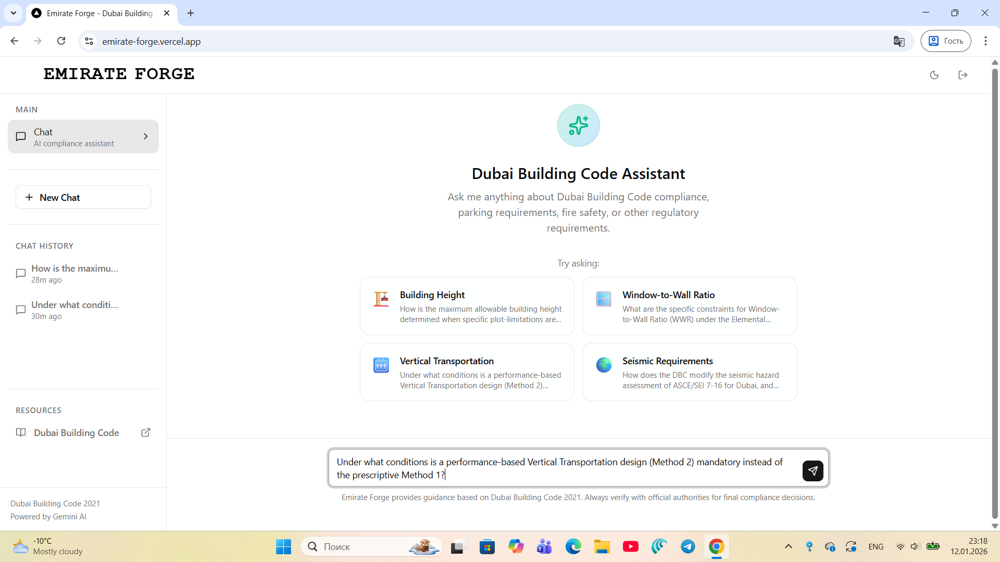
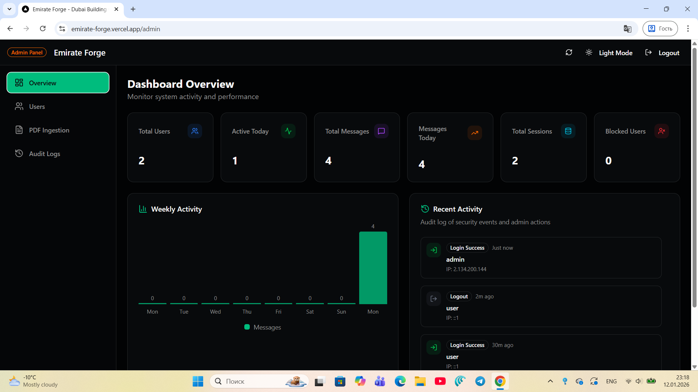
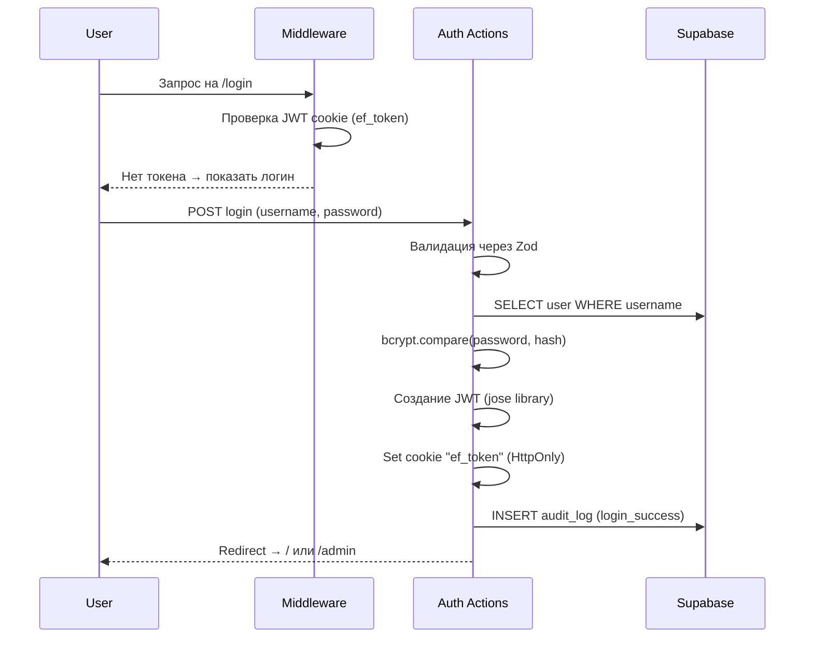
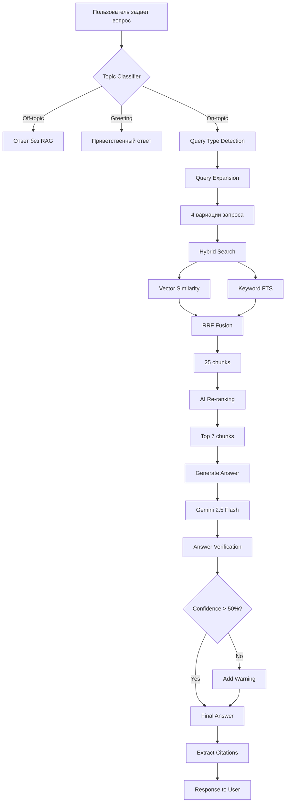

# 🏗️ Emirate Forge - Dubai Building Code AI Assistant

<div align="center">

**Enterprise-grade AI Assistant for Dubai Building Code 2021 Compliance**

[](https://nextjs.org/)
[](https://ai.google.dev/)
[](https://supabase.com/)
[](https://www.typescriptlang.org/)
[](./test)
[](./LICENSE)

**Production-ready • Fully Tested • Scalable Architecture**

</div>

---

## 🎯 Value Proposition

| For Buyers | Benefit |
|------------|---------|
| **Architects & Engineers** | Instant compliance checks against Dubai Building Code 2021 |
| **Government Agencies** | Automate permit review workflows |
| **Construction Companies** | Reduce compliance errors and delays |
| **Consultancies** | White-label AI assistant for clients |

### Why This Project?

- ✅ **Production-Ready** — Battle-tested with 46 automated tests
- ✅ **Enterprise Security** — JWT auth, RBAC, CSRF protection, audit logs
- ✅ **Advanced RAG** — Hybrid search + AI reranking + hallucination detection
- ✅ **Scalable** — Serverless architecture on Supabase + Vercel
- ✅ **Customizable** — Easy to adapt for other building codes or regulations
- ✅ **Multi-language** — English, Arabic, Russian support

---

## 📋 Обзор проекта
## 🖼️ Интерфейс приложения

### Главная страница ассистента


### Админ-панель


**Emirate Forge** — это AI-powered приложение для работы с Dubai Building Code 2021. Использует **RAG (Retrieval-Augmented Generation)** для предоставления точных ответов с цитатами из официального документа.

### Ключевые возможности

| Функция | Описание |
|---------|----------|
| 🤖 **AI Chat** | Gemini 2.5 Flash для анализа запросов и генерации ответов |
| 📚 **RAG Pipeline** | Гибридный поиск (Vector + Keyword) с RRF fusion |
| 📍 **Точные цитаты** | Ссылки на страницы и секции: `[Page 45, Section 3.2.1]` |
| 🌍 **Мультиязычность** | Английский, Арабский, Русский |
| 🔐 **Авторизация** | JWT + Cookies с role-based access (admin/user) |
| 📊 **Admin Panel** | Управление пользователями, загрузка PDF, аудит логи |

---

## 🏛️ Архитектура

### Tech Stack

```
┌─────────────────────────────────────────────────────────────┐
│                        FRONTEND                             │
│  Next.js 15 (App Router) + React 18 + Tailwind CSS 4        │
└─────────────────────────────────────────────────────────────┘
                              │
                              ▼
┌─────────────────────────────────────────────────────────────┐
│                      SERVER ACTIONS                         │
│  auth.ts │ chat.ts │ chat-history.ts │ admin.ts │ ingest    │
└─────────────────────────────────────────────────────────────┘
                              │
          ┌───────────────────┼───────────────────┐
          ▼                   ▼                   ▼
┌─────────────────┐  ┌─────────────────┐  ┌─────────────────┐
│   LIB/AUTH.TS   │  │   LIB/RAG.TS    │  │  LIB/AGENTS.TS  │
│ JWT Sessions    │  │ Hybrid Search   │  │ Query Expansion │
│ Password Hash   │  │ Vector + FTS    │  │ Re-ranking      │
│ Audit Logging   │  │ RRF Fusion      │  │ Verification    │
└─────────────────┘  └─────────────────┘  └─────────────────┘
                              │
                              ▼
┌─────────────────────────────────────────────────────────────┐
│                       SUPABASE                              │
│  PostgreSQL + pgvector (768 dims) + Full-Text Search        │
│  Tables: users, dubai_code_chunks, chat_sessions, etc.      │
└─────────────────────────────────────────────────────────────┘
                              │
                              ▼
┌─────────────────────────────────────────────────────────────┐
│                      GOOGLE GEMINI                          │
│  gemini-2.5-flash (Chat) + text-embedding-004 (Vectors)     │
└─────────────────────────────────────────────────────────────┘
```

---

## 🔄 Как работает приложение

### 1. 🔐 Процесс авторизации



**Ключевые моменты:**
- JWT токен хранится в HttpOnly cookie `ef_token`
- Middleware проверяет токен **без обращения к БД** (быстро!)
- Роли: `admin` (полный доступ) и `user` (только чат)
- Все действия логируются в `audit_logs`

### 2. 📄 Загрузка PDF (Admin)

```mermaid
flowchart TD
    A[Admin открывает /admin] --> B[Выбирает вкладку PDF]
    B --> C[Нажимает "Ingest PDF"]
    C --> D[Читает public/dubai-code.pdf]
    D --> E[Парсинг PDF по страницам]
    E --> F[Разбивка на чанки 800 символов]
    F --> G[Извлечение метаданных]
    G --> H[Генерация embeddings]
    H --> I[Сохранение в dubai_code_chunks]
```

**Процесс ingestion:**

1. **Парсинг PDF** — `pdf-parse` извлекает текст постранично
2. **Chunking** — `RecursiveCharacterTextSplitter` делит на части по 800 символов с overlap 150
3. **Metadata extraction** — из каждого чанка извлекаются:
   - Номер страницы
   - Chapter (Chapter 4: Fire Safety)
   - Section (4.2.1)
   - Table ID (Table 4-1)
4. **Embeddings** — Gemini `text-embedding-004` создает 768-мерные векторы
5. **Storage** — чанки с embeddings сохраняются в Supabase с pgvector

### 3. 💬 RAG Chat Pipeline (Advanced)



**Этапы Advanced RAG Pipeline:**

#### Step 0: Topic Classification
```typescript
// Быстрая проверка - нужен ли RAG вообще?
const topic = await classifyTopic("What are parking requirements?");
// → { isOnTopic: true, shouldUseRAG: true }
```

#### Step 1: Query Expansion
```typescript
// "parking requirements" расширяется до:
[
  "parking requirements",
  "vehicle parking standards Dubai",
  "parking space dimensions building code",
  "car parking regulations UAE"
]
```

#### Step 2: Hybrid Search
```sql
-- Комбинация Vector + Full-Text Search
SELECT * FROM match_dubai_code_hybrid(
  query_text := 'parking requirements',
  query_embedding := [768 floats],
  keyword_weight := 0.3,
  vector_weight := 0.7,
  rrf_k := 60  -- Reciprocal Rank Fusion constant
);
```

#### Step 3: Re-ranking
```typescript
// AI оценивает релевантность каждого чанка (0-100)
const reranked = await rerankChunks(question, chunks, topK=7);
// Фильтрует чанки со score < 40
```

#### Step 4: Answer Generation
```typescript
// Gemini получает контекст + историю диалога
const answer = await generateChatResponse({
  systemPrompt: COMPLIANCE_SYSTEM_PROMPT,
  userMessage: question,
  context: formattedChunks,
  conversationHistory: last6Messages
});
```

#### Step 5: Verification
```typescript
// Проверка на галлюцинации
const verified = await verifyAnswer(answer, chunks, question);
// → { isVerified: true, confidence: 85, supportingQuotes: [...] }
```

### 4. 📜 История чатов

```
┌─────────────────┐     ┌─────────────────┐     ┌─────────────────┐
│  chat_sessions  │────▶│  chat_messages  │───▶│    citations    │
│                 │     │                 │     │   (JSONB)       │
│  id, user_id    │     │  session_id     │     │                 │
│  title          │     │  role (user/ai) │     │  page, section  │
│  created_at     │     │  content        │     │  excerpt        │
└─────────────────┘     └─────────────────┘     └─────────────────┘
```

- Сессии автоматически создаются при первом сообщении
- Название сессии = первые 50 символов первого сообщения
- Поддержка "memory" — последние 6 сообщений передаются в Gemini

---

## 🚀 Установка и запуск

### Требования
- Node.js 20+
- Supabase проект
- Google Gemini API key

### 1. Клонирование и установка

```bash
git clone https://github.com/MakazhanAlpamys/Emirate-Forge.git
cd Emirate-Forge
npm install
```

### 2. Настройка переменных окружения

Создайте `.env.local`:

```env
# Supabase
NEXT_PUBLIC_SUPABASE_URL=https://your-project.supabase.co
SUPABASE_SERVICE_ROLE_KEY=your_service_role_key

# Gemini AI
GEMINI_API_KEY=your_gemini_api_key

# JWT (минимум 32 символа!)
JWT_SECRET=your_super_secret_jwt_key_minimum_32_chars
```

### 3. Миграция базы данных

Выполните SQL из `supabase/migrations/001_complete_setup.sql` в Supabase SQL Editor.

Это создаст:
- Таблицы: `users`, `dubai_code_chunks`, `chat_sessions`, `chat_messages`, `audit_logs`, `rate_limits`
- pgvector extension для векторного поиска
- RPC функции: `match_dubai_code_hybrid`, `search_dubai_code_exact`, и др.
- Row Level Security (RLS) политики
- **Дефолтный админ**: `admin` / `Admin123!`


### 4. Запуск

```bash
# Development
npm run dev

# Production build
npm run build
npm start
```

### 5. Первоначальная настройка

1. Войдите как **admin** → `/login` (логин: `admin`, пароль: `Admin123!`)
2. **⚠️ Смените пароль!** (в User Management)
3. Перейдите в **Admin Panel** → `/admin`
4. Выберите вкладку **PDF Management**
5. Нажмите **Ingest Dubai Code** (PDF должен быть в `public/dubai-code.pdf`)
5. Дождитесь завершения (~5-10 минут для большого PDF)

---

## 📁 Структура проекта

```
permitai/
├── app/                      # Next.js App Router
│   ├── page.tsx             # Главная страница (чат)
│   ├── login/page.tsx       # Страница логина
│   ├── admin/page.tsx       # Admin панель
│   └── api/chat/stream/     # Streaming API endpoint
│
├── actions/                  # Server Actions
│   ├── auth.ts              # Login, logout, create user
│   ├── chat.ts              # RAG chat pipeline
│   ├── chat-history.ts      # Sessions & messages
│   ├── admin.ts             # Admin dashboard actions
│   └── ingest-pdf.ts        # PDF processing
│
├── lib/                      # Core библиотеки
│   ├── auth.ts              # JWT, sessions, audit
│   ├── supabase.ts          # DB clients & rate limiting
│   ├── gemini.ts            # LangChain + Gemini config
│   ├── rag.ts               # Hybrid search engine
│   ├── agents.ts            # AI agents (expansion, rerank, verify)
│   └── validations.ts       # Zod schemas
│
├── components/               # React компоненты
│   ├── chat/                # Chat UI components
│   ├── admin/               # Admin dashboard components
│   └── ui/                  # shadcn/ui components
│
├── types/index.ts           # TypeScript типы
├── middleware.ts            # Auth middleware
├── supabase/migrations/     # SQL миграции
└── scripts/                 # Утилиты
    └── test-*.js            # Тестовые скрипты
```

---


## 🔒 Безопасность

| Мера | Реализация |
|------|------------|
| **Пароли** | bcrypt с 12 раундами |
| **JWT** | HS256, HttpOnly cookie, 7 дней |
| **CSRF** | Токен в отдельной HttpOnly cookie |
| **Rate Limiting** | 20 запросов/минуту (Supabase-based) |
| **Input Validation** | Zod schemas на всех endpoints |
| **XSS Protection** | DOMPurify для user content |
| **RLS** | Row Level Security в Supabase |
| **Audit Logs** | Все действия логируются |

---

## 📊 Admin Panel Features

- **📈 Dashboard** — статистика пользователей и сообщений
- **👥 User Management** — создание, блокировка, смена ролей
- **📄 PDF Ingestion** — загрузка и индексация документов
- **📜 Audit Logs** — просмотр всех действий в системе
- **🧪 RAG Diagnostics** — тестирование подключения к БД

---

## 🧪 Тестирование

```bash
# Запуск тестов
npm test

# С UI
npm run test:ui

# Coverage report
npm run test:coverage
```

---

## 📝 API Reference

### Chat Endpoint (Streaming)

```typescript
POST /api/chat/stream

Headers:
  Cookie: ef_token=<jwt>

Body:
{
  "message": "What are parking requirements?",
  "sessionId": "uuid" // optional
}

Response: Server-Sent Events (streaming)
```

### Server Actions

```typescript
// Отправка сообщения
const response = await sendChatMessage({
  message: "What is minimum ceiling height?",
  sessionId: "existing-session-id"
});

// Получение истории
const { sessions } = await getUserSessions();
const { messages } = await getSessionMessages(sessionId);
```

---

## 🛣️ Roadmap

- [x] JWT Authentication
- [x] Advanced RAG Pipeline
- [x] Hybrid Search (Vector + FTS)
- [x] Answer Verification
- [x] Audit Logging
- [x] RLS Policies для безопасности
- [x] Real-time PDF ingestion progress
- [x] Unit tests (46 passing)
- [ ] Redis Rate Limiting (for high-scale)
- [ ] Email Verification
- [ ] Multi-document support
- [ ] PDF.js for precise page extraction
- [ ] Table parsing for structured data

---

## 💰 Commercial Use Cases

| Use Case | Description |
|----------|-------------|
| **SaaS Product** | Sell subscriptions to architects, engineers, consultants |
| **API Service** | Offer RAG-as-a-Service for building code queries |
| **Enterprise License** | White-label for government agencies or large firms |
| **Consulting Tool** | Internal tool for compliance consultancies |
| **Integration** | Embed in permit management systems |

---

## 📄 License

MIT License © 2026 Makazhan Alpamys

---

<div align="center">
  <sub>Built with ❤️ using Next.js, Gemini AI, and Supabase</sub>
  <br>
  <sub>Author: <strong>Makazhan Alpamys</strong></sub>
</div>
