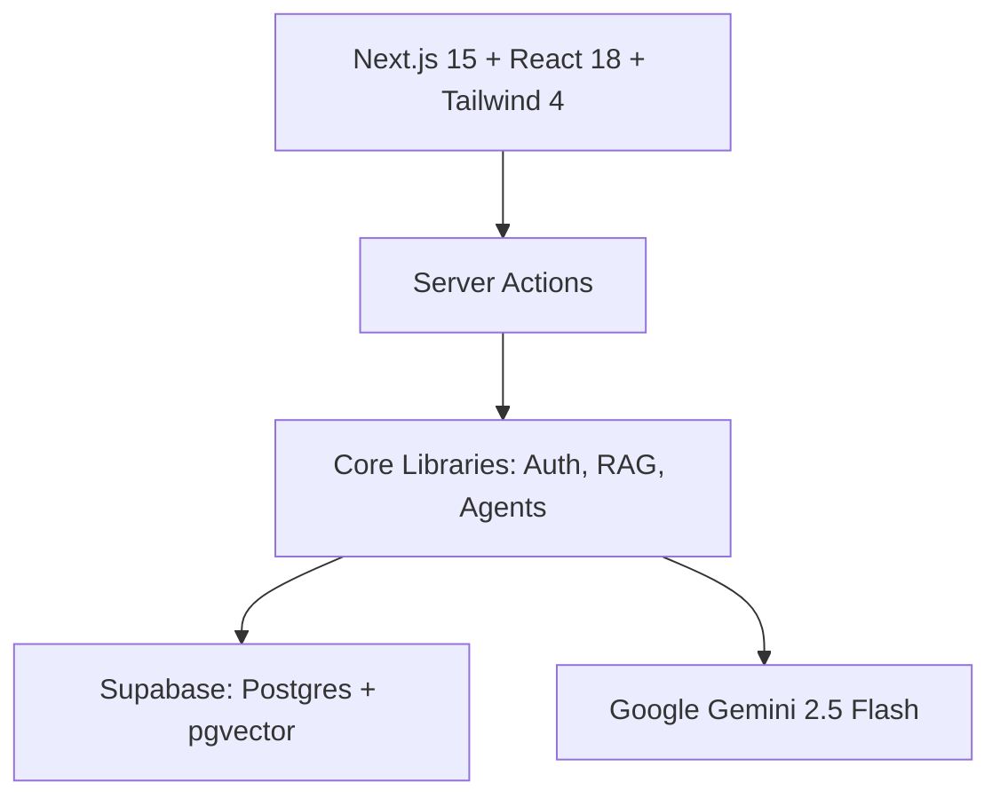
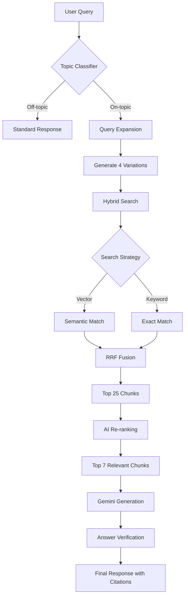

# 🏗️ Emirate Forge - Dubai Building Code AI Assistant

<div align="center">

**Enterprise-grade AI Assistant for Dubai Building Code 2021 Compliance**

[](https://nextjs.org/)
[](https://ai.google.dev/)
[](https://supabase.com/)
[](https://www.typescriptlang.org/)
[](./test)
[](./plan.md)
[](./LICENSE)

**Production-ready • Fully Tested • 93% Citation Accuracy • Scalable Architecture**

</div>

---

## 📋 Project Overview

**Emirate Forge** is a specialized AI assistant designed to navigate the **Dubai Building Code 2021**. It leverages an Advanced RAG (Retrieval-Augmented Generation) pipeline to provide accurate, citation-backed answers to complex compliance queries.

### Key Features

| Feature | Description |
|---------|-------------|
| 🤖 **AI Chat** | Powered by **Gemini 2.5 Flash** for rapid reasoning and response generation. |
| 📚 **Advanced RAG** | **Hybrid Search** (Vector + Keyword) with Reciprocal Rank Fusion (RRF) and AI Re-ranking. |
| 📍 **Smart Citations** | Automatically parses and verifies citations (e.g., `[Page 42, Section 3.1]`) with **93% accuracy**. |
| 📊 **Confidence Scoring** | Real-time confidence assessment for every generated answer. |
| 📄 **Rich Excerpts** | Renders tables and lists from the source PDF directly in the chat. |
| 🔗 **PDF Deep Links** | Direct links to the exact page in the official PDF document. |
| 🌍 **Multi-language** | Full support for **English**, **Arabic**, and **Russian**. |
| 🔐 **Enterprise Security** | JWT Authentication, Role-Based Access Control (RBAC), and Audit Logging. |
| 🛠️ **Admin Panel** | Comprehensive dashboard for User Management, PDF Ingestion, and System Analytics. |

---

## 🖼️ Interface

### AI Assistant


### Admin Dashboard


---

## 🏛️ Architecture

### Tech Stack



- **Frontend:** Next.js 15 (App Router), React 18, Tailwind CSS 4, shadcn/ui.
- **Backend:** Next.js Server Actions.
- **Database:** Supabase (PostgreSQL) with `pgvector` and Full-Text Search.
- **AI/ML:** Google Gemini 2.5 Flash, `text-embedding-004`.
- **Auth:** Custom JWT implementation with HttpOnly cookies.

### 🔄 System Workflows

#### 1. RAG Chat Pipeline
How the system delivers accurate answers:



#### 2. PDF Ingestion Process
How documents are processed and indexed:

```mermaid
flowchart LR
    A[Admin Upload] --> B[PDF Parse]
    B --> C[Page Extraction]
    C --> D[Chunking (800 chars)]
    D --> E[Metadata Extraction]
    E --> F[Embedding Generation]
    F --> G[Supabase Storage]
```

---

## 🚀 Getting Started

### Prerequisites
- Node.js 20+
- Supabase Project
- Google Gemini API Key

### Installation

1. **Clone the repository**
   ```bash
   git clone https://github.com/MakazhanAlpamys/Emirate-Forge.git
   cd Emirate-Forge
   npm install
   ```

2. **Configure Environment**
   Create a `.env.local` file:
   ```env
   NEXT_PUBLIC_SUPABASE_URL=https://your-project.supabase.co
   SUPABASE_SERVICE_ROLE_KEY=your_service_role_key
   GEMINI_API_KEY=your_gemini_api_key
   JWT_SECRET=your_super_secret_jwt_key_must_be_32_chars_long
   ```

3. **Database Setup**
   Run the SQL migration script in your Supabase SQL Editor:
   - File: `supabase/migrations/001_complete_setup.sql`
   - This creates all tables (`users`, `chat_sessions`, `dubai_code_chunks`, etc.) and the default admin account.

4. **Run the Application**
   ```bash
   npm run dev
   ```

### Initial Setup
1. Log in at `/login` with default credentials:
   - **Username:** `admin`
   - **Password:** `Admin123!`
2. Go to **Admin Panel** -> **User Management** and **change your password immediately**.
3. Go to **PDF Management** and ingest the `dubai-code.pdf` file (ensure it is placed in the `public` folder).

---

## 🔒 Security Measures

- **Authentication:** Secure JWT tokens stored in HttpOnly cookies.
- **Passwords:** Bcrypt hashing with 12 rounds.
- **Rate Limiting:** Built-in protection against API abuse.
- **Input Validation:** Strict Zod schemas for all server actions.
- **Audit Logs:** Complete tracking of all user actions and system events.

---

## 🧪 Testing

The project maintains high code quality with a comprehensive test suite.

```bash
# Run all unit and integration tests
npm test

# Run tests with UI
npm run test:ui

# Check test coverage
npm run test:coverage
```

Current Status: **46 passing tests** covering Auth, RAG Logic, and Parsers.

---

## 📝 Roadmap

- [x] Advanced RAG Pipeline (Hybrid Search + Reranking)
- [x] Smart Citation System
- [x] Admin Dashboard & User Management
- [x] PDF Ingestion & Vectorization
- [x] Multi-language Support
- [ ] Redis Caching for Rate Limiting
- [ ] Email Verification Flow
- [ ] Support for Multiple Documents/Codes
- [ ] OCR Support for Scanned PDFs

---

## 📄 License

MIT License © 2026 Makazhan Alpamys
