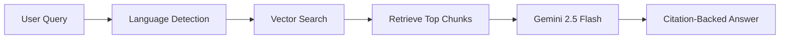

# Emirate Forge - Dubai Building Code Compliance Assistant

## 📋 Project Overview

**Emirate Forge** is an AI-powered compliance assistant personalized for the **Dubai Building Code 2021**. The application leverages advanced **RAG (Retrieval-Augmented Generation)** technology to provide instant, citation-backed answers to complex regulatory questions, empowering construction professionals to navigate compliance with confidence and speed.

### Key Features
- **🤖 Intelligent Compliance Analysis**: Powered by **Google Gemini 2.5 Flash** for deep understanding of technical queries.
- **📚 Accurate RAG System**: Vector-based search through the official Dubai Building Code 2021 ensures every answer is grounded in the source text.
- **🌍 Multilingual Support**: Seamlessly converses in **English, Arabic, and Russian**, automatically detecting the user's language.
- **📍 Precise Citations**: Answers include inline citations pointing to the exact page and section of the code (e.g., *[Page 45, Section 3.2.1]*).
- **🔐 Enterprise-Ready Auth**: Secure role-based access for Admins and Team Members.
- **📊 Admin Ingestion Pipeline**: Powerful diagnostics dashboard for processing and indexing regulatory PDFs.

---

## 🏗️ Architecture

### Tech Stack
- **Framework**: Next.js 15 (App Router)
- **AI/ML**: Google Gemini 2.5 Flash + LangChain
- **Database**: Supabase (PostgreSQL + pgvector)
- **Vector Embeddings**: Gemini text-embedding-004 (768 dimensions)
- **UI/UX**: Tailwind CSS 4, Radix UI, Framer Motion

### Data Flow

#### User Query Pipeline


---

## 🚀 Getting Started

### Prerequisites
- Node.js 20+
- Supabase project
- Google Gemini API key

### Installation

1.  **Clone and Install**
    ```bash
    git clone https://github.com/MakazhanAlpamys/Emirate-Forge.git
    cd emirate-forge
    npm install
    ```

2.  **Environment Setup**
    Create a `.env.local` file:
    ```env
    NEXT_PUBLIC_SUPABASE_URL=your_supabase_url
    SUPABASE_SERVICE_ROLE_KEY=your_service_role_key
    GEMINI_API_KEY=your_gemini_api_key
    ```

3.  **Database Migration**
    Run the SQL script located in `supabase/migrations/full_setup.sql` in your Supabase SQL Editor.

4.  **Run Development Server**
    ```bash
    npm run dev
    ```

### Initial Setup
1.  **Ingest Data**: Log in as Admin (default: `admin` / `admin123`) and navigate to `/admin` to ingest the Dubai Building Code PDF.
2.  **Start Chatting**: Log in as User (default: `user` / `user123`) to test the chat interface.

---

## 🗺️ Roadmap

- [ ] **Production Rate Limiting**: Migrate from in-memory store to Redis.
- [ ] **Email Verification**: Implement proper sign-up flow with email confirmation.
- [ ] **Mobile App**: React Native wrapper for on-site usage.
- [ ] **Audit Logs**: Track user queries and compliance checks for reporting.

---

## 📄 License

Proprietary - Emirate Forge Team
