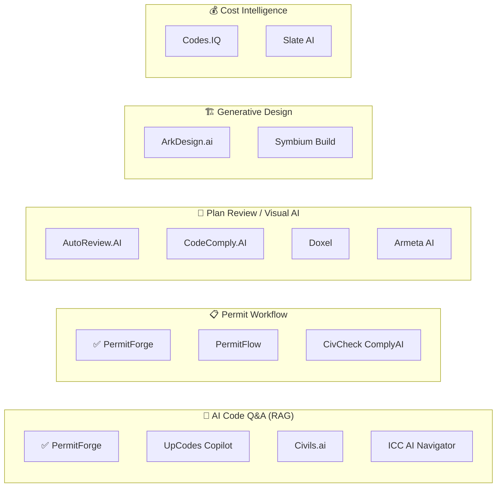
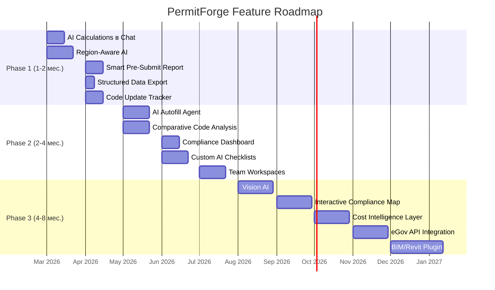

# 🔬 Глубокий анализ конкурентов и план развития PermitForge

> **Дата:** 8 марта 2026  
> **Проект:** PermitForge — AI-Powered Building Code Compliance Assistant  
> **Цель:** Изучить конкурентов, выявить лучшие продукты и функционал для интеграции

---

## 📊 Карта конкурентного ландшафта

Рынок AI в строительстве можно разделить на **5 сегментов**. PermitForge уже занимает 2 из них (RAG-чат + Permit Lifecycle), но для лидерства нужно расширяться:

---

## 🏢 Детальный разбор каждого конкурента

### 1. PermitFlow (США, Y Combinator, $31M+ raised)

| Параметр | Детали |
|----------|--------|
| **Фокус** | End-to-end автоматизация получения строительных разрешений |
| **Модель** | B2B SaaS для застройщиков, подрядчиков |
| **База данных** | 12 млн+ муниципальных данных по всей территории США |

**Ключевые продукты, которых нет у нас:**

| # | Продукт | Как работает | Ценность |
|---|---------|-------------|----------|
| 1 | **Intake Agent** | AI автоматически извлекает данные из CRM, контрактов и файлов клиента для инициации проекта | Ноль ручного ввода, моментальное создание permit-заявки |
| 2 | **Research Agent** | Глубокое исследование базы AHJ (Authority Having Jurisdiction) — автоматическое определение ВСЕХ требований конкретного муниципалитета | Пользователю не нужно знать, какие формы/правила нужны |
| 3 | **Voice AI Agent** | Голосовой AI звонит и назначает инспекции с домовладельцами после получения разрешения | Полная автоматизация пост-permit процесса |
| 4 | **Auto Form-Fill** | AI заполняет правительственные бланки + напоминания о дедлайнах/истекающих разрешениях | Экономия часов ручной работы |
| 5 | **Pipeline Visualization** | Визуальный pipeline всех permit-заявок, алерты о необходимых действиях | Управление портфелем проектов |
| 6 | **AHJ Database** | Своя проприетарная база данных муниципальных требований (12M+ data points) | AI постоянно обучается на реальных данных |

> [!IMPORTANT]
> **Главное, что взять:** Концепцию AI-агентов (Intake Agent, Research Agent) и Pipeline Visualization. Вместо модели "пользователь заполняет форму" → модель "AI заполняет всё сам, пользователь проверяет".

---

### 2. Armeta AI (Казахстан/США, Alchemist Accelerator, $1M raised)

| Параметр | Детали |
|----------|--------|
| **Фокус** | Автоматизация экспертизы строительных проектов + MTO |
| **Клиенты** | Министерство индустрии и строительства РК, гос. агентства Катара |
| **Модель** | B2G (Government), Enterprise |

**Ключевые продукты:**

| # | Продукт | Как работает | Ценность |
|---|---------|-------------|----------|
| 1 | **P&ID → MTO Engine** | Конвертация чертежей трубопроводов (P&ID) в спецификации материалов (Material Take-Off) | 8x рост производительности, -50% стоимости MTO |
| 2 | **Human-in-the-loop Validation** | 99% точность через валидацию человеком + full audit trail | Надёжность для госорганов |
| 3 | **Legacy PDF Data Extraction** | Извлечение инженерных данных из старых PDF-документов | Работа с устаревшей документацией |
| 4 | **Revision Cycle Management** | 100% traceability через множество циклов ревизий | Audit-ready документация |

> [!TIP]
> **Главное, что взять:** Human-in-the-loop подход и audit trail. Для государственных клиентов критично иметь полный трекинг всех AI-решений с возможностью ручной валидации.

---

### 3. UpCodes (США, крупнейшая база строительных кодов)

| Параметр | Детали |
|----------|--------|
| **Фокус** | AI-поиск и анализ строительных кодов |
| **Модель** | B2B SaaS ($39-$68/user/month) |
| **База** | 7,000+ обновлений кодов/месяц по всем юрисдикциям |

**Ключевые продукты:**

| # | Продукт | Как работает | Ценность |
|---|---------|-------------|----------|
| 1 | **UpCodes Copilot** | Натуральный язык → ответы с цитатами из кодов, чек-листы, суммаризации, расчёты | Аналог нашего чата, но с расчётами |
| 2 | **Jurisdiction-Specific AI** | Ответы адаптированы к юрисдикции пользователя (штат/город) | Точные ответы для конкретного региона |
| 3 | **Assembly Finder** | Мгновенный поиск UL и GA сборок (assemblies) | Ускорение спецификации материалов |
| 4 | **Code Change Tracker** | Автоматическое отслеживание 7,000 изменений/месяц | Всегда актуальная база |
| 5 | **Automated Code Analysis** | AI-анализ проекта на соответствие кодам | Проактивная проверка |

> [!IMPORTANT]
> **Главное, что взять:** Jurisdiction-Specific AI (у нас уже есть foundation через document_registry → добавить region_id), Code Change Tracker (уведомления об обновлениях кодов), AI Calculations (расчёты в чате).

---

### 4. Civils.ai (Глобальная платформа для AEC)

| Параметр | Детали |
|----------|--------|
| **Фокус** | AI-ассистент для строительных документов, чертежей, кодов |
| **Модель** | B2B SaaS |
| **Особенность** | Поддержка PDF, CAD, BIM, чертежей |

**Ключевые продукты:**

| # | Продукт | Как работает | Ценность |
|---|---------|-------------|----------|
| 1 | **Multi-Document AI Chat** | Загрузка множества документов + Q&A по всем сразу | Кросс-документный поиск |
| 2 | **Drawing Analysis** | AI анализ архитектурных, структурных, MEP чертежей (vector PDF, scans, BIM) | Работа с визуальными документами |
| 3 | **Structured Data Export** | Экспорт данных в Excel: procurement lists, submittal logs, QA/QC checklists | Интеграция с workflow |
| 4 | **Custom AI Bots** | Создание кастомных AI ботов для конкретных workflow (без кода) | Расширяемость |
| 5 | **Automated Plan Review** | AI ревью планов на compliance | Ускорение ревью |
| 6 | **Comparative Code Analysis** | Сравнение кодов разных юрисдикций бок о бок | Мульти-региональная работа |

> [!TIP]
> **Главное, что взять:** Comparative Code Analysis (для мульти-региональности), Structured Data Export (Excel/CSV), Custom AI Workflows. У них очень интересная фича — **сравнение кодов двух регионов** — идеально для международных застройщиков.

---

### 5. CodeComply.AI (AI план-ревью)

| # | Продукт | Как работает | Ценность |
|---|---------|-------------|----------|
| 1 | **Upload Full Plan Sets** | Загрузка полного комплекта чертежей для AI-анализа | Комплексная проверка |
| 2 | **Multi-Code Check** | IBC, NFPA, ADA, FHA + state amendments | Проверка по множеству стандартов |
| 3 | **Issue Detection + Citations** | AI находит нарушения и указывает точные разделы кодов | Actionable отчёты |
| 4 | **Real-time Designer Feedback** | Обратная связь дизайнеру в реальном времени | Исправление проблем на этапе проектирования |

---

### 6. Symbium Build (AI-зонирование и feasibility)

| # | Продукт | Как работает | Ценность |
|---|---------|-------------|----------|
| 1 | **Computational Law Engine** | Законы переведены в компьютерный код для автоматической проверки | Детерминированная проверка зонирования |
| 2 | **Interactive Zoning Map** | Ввод адреса → визуализация разрешённых параметров на карте | Мгновенное понимание ограничений |
| 3 | **Real-time Violation Feedback** | Рисуешь здание на карте → система мгновенно подсвечивает нарушения красным | Интерактивная проверка |
| 4 | **Feasibility + Cost Report** | Отчёт: что можно построить + стоимость + таймлайн | Полная картина до начала проекта |
| 5 | **Design Marketplace** | Каталог дизайн-решений с ценами от сторонних архитекторов | Marketplace |

> [!WARNING]
> **Это "убийственная" фича:** Interactive Zoning Map + Real-time Compliance. Пользователь видит на карте, что можно строить и какие ограничения, ещё до подачи заявки. Стоит взять на заметку для Phase 3.

---

### 7. CivCheck / ComplyAI (Guided AI Plan Review)

| # | Продукт | Как работает | Ценность |
|---|---------|-------------|----------|
| 1 | **Pre-Submission Check** | Заявитель проверяет заявку на compliance ДО подачи | Меньше отказов |
| 2 | **Guided AI Review** | AI ведёт ревьюера через процесс, указывая на проблемы и объясняя | Ускорение ревью на 90% |
| 3 | **Ethical AI (Human-in-the-Loop)** | AI помогает, но решения принимает человек | Доверие к системе |
| 4 | **Free for Cities** | Бесплатно для муниципалитетов, платят заявители (prescreening fee) | B2G бизнес-модель |

> [!IMPORTANT]
> **Главное, что взять:** Pre-Submission Compliance Check. У нас уже есть `runComplianceCheck()` — можно усилить, сделав его обязательным этапом перед Submit, с детальным отчётом и рекомендациями.

---

### 8. AutoReview.AI (Автоматический ревью сайт-планов)

| # | Продукт | Как работает | Ценность |
|---|---------|-------------|----------|
| 1 | **3D Model Analysis** | Анализ 3D моделей + маркировка нарушений прямо на чертеже | Визуальная обратная связь |
| 2 | **Multi-Format Support** | CAD, BIM, DWG, Revit, PDF | Универсальность |
| 3 | **Detailed Markups** | Добавляет комментарии и маркировки на чертежи с citation кодов | Понятные отчёты |
| 4 | **ML Adaptability** | Система обучается на фидбэке ревьюеров | Постоянное улучшение |

---

### 9. Codes.IQ (Compliance + Cost Intelligence)

| # | Продукт | Как работает | Ценность |
|---|---------|-------------|----------|
| 1 | **Compliance + Cost Integration** | К каждой проверке compliance добавляется стоимость: материалы, труд, cost delta | Бизнес-решения, а не только compliance |
| 2 | **Construction Sequencing** | AI предлагает оптимальный порядок строительных работ | Оптимизация процесса |
| 3 | **Context-Aware Engine** | Не просто поиск, а контекстный анализ с учётом всего проекта | Глубокий анализ |

---

### 10. ICC AI Navigator (International Code Council)

| # | Продукт | Как работает | Ценность |
|---|---------|-------------|----------|
| 1 | **Code-Specific LLM** | LLM обучена экспертами ICC на верифицированных Q&A | Высокая точность (>90%) |
| 2 | **Confidence Indicator** | AI показывает, когда не уверена в ответе | Прозрачность |
| 3 | **BIM/Revit Integration** | Привязка кодов к элементам BIM-модели через Revit Add-In | Нативная интеграция |
| 4 | **Code Year + Location** | Выбор штата, кода и года для точных ответов | Точность |

---

### 11. Doxel (Computer Vision для стройки)

| # | Продукт | Как работает | Ценность |
|---|---------|-------------|----------|
| 1 | **Site Scan → BIM Compare** | Дроны/камеры сканируют стройку, AI сравнивает с BIM | Контроль качества в реальном времени |
| 2 | **75+ Construction Phases** | Распознавание 75+ типов работ | Детальный прогресс |
| 3 | **Budget/Schedule Tracking** | Cross-reference прогресса с бюджетом и расписанием | Финансовый контроль |

---

## 🆚 Сравнительная матрица: PermitForge vs Все конкуренты

| Функция | PermitForge | PermitFlow | Armeta | UpCodes | Civils.ai | CodeComply | Symbium | CivCheck | Codes.IQ |
|---------|:-----------:|:----------:|:------:|:-------:|:---------:|:----------:|:-------:|:--------:|:--------:|
| **AI RAG Chat** | ✅ Отлично | ❌ | ❌ | ✅ | ✅ | ❌ | ❌ | ❌ | ✅ |
| **Semantic Cache** | ✅ | ❌ | ❌ | ❌ | ❌ | ❌ | ❌ | ❌ | ❌ |
| **Chunk Citations** | ✅ | ❌ | ❌ | ✅ | ✅ | ✅ | ❌ | ❌ | ❌ |
| **Tree Reasoning** | ✅ Уникально | ❌ | ❌ | ❌ | ❌ | ❌ | ❌ | ❌ | ❌ |
| **Permit Lifecycle** | ✅ 6 статусов | ✅ | ❌ | ❌ | ❌ | ❌ | ❌ | ❌ | ❌ |
| **AI Compliance Check** | ✅ Базовый | ✅ | ✅ | ✅ | ✅ | ✅ | ✅ | ✅ | ✅ |
| **PDF Ingestion** | ✅ | ❌ | ✅ | ❌ | ✅ | ❌ | ❌ | ❌ | ❌ |
| **Multi-Region** | 🟡 Готов | ✅ Nationwide | 🟡 | ✅ | ✅ | ✅ | 🟡 | 🟡 | ❌ |
| **Drawing/CAD Analysis** | ❌ | ❌ | ✅ | ❌ | ✅ | ✅ | ❌ | ❌ | ❌ |
| **Auto Form-Fill** | ❌ | ✅ | ❌ | ❌ | ❌ | ❌ | ❌ | ❌ | ❌ |
| **AI Agents** | ❌ | ✅ | ❌ | ❌ | ✅ | ❌ | ❌ | ❌ | ❌ |
| **Cost Intelligence** | ❌ | ❌ | ❌ | ❌ | ❌ | ❌ | ✅ | ❌ | ✅ |
| **Interactive Map** | ❌ | ❌ | ❌ | ❌ | ❌ | ❌ | ✅ | ❌ | ❌ |
| **BIM Integration** | ❌ | ❌ | ❌ | ❌ | ✅ | ✅ | ❌ | ❌ | ❌ |
| **Pre-Submit Check** | 🟡 | ❌ | ✅ | ❌ | ❌ | ❌ | ❌ | ✅ | ❌ |
| **Code Comparison** | ❌ | ❌ | ❌ | ❌ | ✅ | ❌ | ❌ | ❌ | ❌ |
| **Admin Dashboard** | ✅ | ✅ | ❌ | ❌ | ❌ | ❌ | ❌ | ✅ | ❌ |
| **Email Notifications** | ✅ | ✅ | ❌ | ❌ | ❌ | ❌ | ❌ | ❌ | ❌ |
| **566+ Tests** | ✅ Уникально | ? | ? | ? | ? | ? | ? | ? | ? |

---

## 🎯 ТОП-15 функций для заимствования (приоритизированные)

### 🔴 Приоритет 1 — Быстрая реализация, высокий ROI

Эти фичи можно реализовать быстро, используя уже существующую архитектуру PermitForge:

#### 1. 📊 AI Calculations в чате (от UpCodes)
**Что:** Чат умеет не только отвечать на вопросы, но и **считать**: площади, количество паркинга, ширину коридоров, плотность населения и т.д.
**Как реализовать:** Добавить в system prompt инструкции для расчётов + function calling для калькуляций.
**Зачем:** Пользователь спрашивает: *"Сколько парковочных мест нужно для жилого здания 5000 м²?"* → AI ищет нормативы в кодах + считает.
**Сложность:** 🟢 Низкая — расширение system prompt + structured output

#### 2. 📋 Smart Pre-Submit Compliance Report (от CivCheck + UpCodes)
**Что:** Перед отправкой заявки (Submit) система генерирует **детальный отчёт** с рекомендациями, а не просто "compliant/non_compliant".
**Как реализовать:** Расширить `runComplianceCheck()`:
- Добавить severity levels (Critical / Warning / Info)
- AI предлагает конкретные исправления (не просто ошибки)
- Генерировать PDF-отчёт compliance
**Зачем:** Уменьшает количество revision_requested, ускоряет approval.
**Сложность:** 🟢 Низкая — расширение существующего кода

#### 3. 🌍 Region-Aware AI (от PermitFlow + UpCodes)
**Что:** При вопросе в чате или проверке compliance, AI учитывает КОНКРЕТНЫЙ регион (Дубай, Абу-Даби, Астана, Алматы, etc.)
**Как реализовать:** 
- Добавить `region_id` в `document_registry`
- `document-selector.ts` обогатить региональной фильтрацией
- Пользователь выбирает регион в профиле → все запросы автоматически фильтруются
**Зачем:** Ваша RAG-система уже динамическая — нужна только маршрутизация по региону.
**Сложность:** 🟢 Низкая — у вас уже есть `document_registry` с `keywords` и `categories`

#### 4. 📤 Structured Data Export (от Civils.ai)
**Что:** Экспорт данных в Excel/CSV: чек-листы compliance, данные permit-заявки, результаты проверки.
**Как реализовать:** npm-пакет типа `xlsx` или `csv-stringify` + новый API route.
**Зачем:** Интеграция с существующими workflow клиентов.
**Сложность:** 🟢 Низкая

#### 5. 🔔 Code Update Tracker (от UpCodes)
**Что:** Система уведомляет пользователя, когда строительные коды обновились: *"Раздел 5.2 Building Code обновлён: new fire safety requirements"*.
**Как реализовать:** При re-ingestion документа — AI сравнивает старые и новые chunks → генерирует diff-уведомления.
**Зачем:** Пользователи всегда знают об актуальных изменениях.
**Сложность:** 🟡 Средняя

---

### 🟡 Приоритет 2 — Средний срок, высокая ценность

#### 6. 🤖 AI Autofill Agent (от PermitFlow)
**Что:** AI автоматически заполняет форму permit-заявки на основе загруженных документов или прошлых заявок.
**Как реализовать:**
- Кнопка "Auto-fill from documents" на Step 1-3
- Gemini Structured Output → JSON → заполнение формы
- Возможность: загрузить описание проекта в свободной форме → AI структурирует
**Зачем:** Главный pain point — ручной ввод данных. Экономит 30-60 минут на заявку.
**Сложность:** 🟡 Средняя

#### 7. 🔍 Comparative Code Analysis (от Civils.ai)
**Что:** Сравнение требований двух разных регионов бок о бок: *"Какие отличия пожарных норм между Дубаем и Абу-Даби?"*
**Как реализовать:**
- Новый режим чата: "Compare Mode"
- Два параллельных RAG search по разным document groups
- AI генерирует таблицу сравнения
**Зачем:** Критично для международных застройщиков, работающих в нескольких регионах.
**Сложность:** 🟡 Средняя

#### 8. 📊 Compliance Dashboard (от Codes.IQ)
**Что:** Визуальная dashboard с метриками compliance для каждого проекта: score, risk areas, progress tracking.
**Как реализовать:**
- Новая страница `/permits/[id]/compliance-dashboard`
- Визуализация результатов compliance check через Recharts (уже есть в проекте)
- Radar chart для каждой категории (fire, parking, structural, etc.)
**Зачем:** Наглядное понимание проблемных зон проекта.
**Сложность:** 🟡 Средняя

#### 9. 📝 Custom AI Workflows / Checklists (от Civils.ai)
**Что:** Создание кастомных чек-листов проверки: пользователь/админ создаёт шаблон → AI заполняет его на основе RAG.
**Как реализовать:**
- Шаблон чек-листа (JSON schema) → RAG-запросы по каждому пункту → Gemini structured output
- Например: "Fire Safety Checklist for Residential Buildings" → AI проверяет каждый пункт
**Зачем:** Адаптация под конкретные workflow клиентов; интеграция с инспекторами.
**Сложность:** 🟡 Средняя

#### 10. 🏢 Team Workspaces (от PermitFlow)
**Что:** Несколько пользователей работают над одной permit-заявкой: архитектор, инженер, заказчик.
**Как реализовать:**
- Новая таблица `permit_collaborators` (permit_id, user_id, role)
- Адаптировать RLS для team access
- Activity feed: кто что изменил
**Зачем:** Строительные проекты — всегда командная работа.
**Сложность:** 🟡 Средняя

---

### 🟢 Приоритет 3 — Долгосрочные, высокоценные функции

#### 11. 📐 Vision AI: Drawing Analysis (от Armeta + Civils.ai + CodeComply)
**Что:** Загрузка чертежей/планов → AI анализирует визуальное содержимое + автоматически извлекает данные (площади, этажи, etc.)
**Как реализовать:**
- Gemini 2.5 Pro Vision API для анализа изображений/PDF чертежей
- Structured Output: JSON с extracted dimensions
- Кнопка "Заполнить из чертежа" на Step 2 (Building Details)
**Зачем:** "Убийственная" фича: пользователь загружает план → всё заполняется автоматически.
**Сложность:** 🔴 Высокая, но Gemini Vision уже поддерживает

#### 12. 🗺️ Interactive Compliance Map (от Symbium Build)
**Что:** Карта с визуализацией зон: пользователь вводит адрес → видит разрешённые параметры строительства (setbacks, высота, FAR).
**Как реализовать:**
- Leaflet/Mapbox для карты
- Геокодирование адреса → привязка к зоне
- Overlay с параметрами из кодов
**Зачем:** WOW-фактор, визуальное понимание ограничений.
**Сложность:** 🔴 Высокая (нужны гео-данные по зонам)

#### 13. 💰 Cost Intelligence Layer (от Codes.IQ)
**Что:** К каждому требованию compliance добавить оценку стоимости: *"Требуется спринклерная система → ~$15,000-25,000 для здания такого типа"*.
**Как реализовать:**
- База стоимостей материалов и работ (отдельная таблица/документ)
- RAG + cost database → integrated response
**Зачем:** Превращает compliance из "pass/fail" в бизнес-решение.
**Сложность:** 🔴 Высокая (нужны данные по ценам)

#### 14. 🔗 e-Gov API Integration (от PermitFlow)
**Что:** Интеграция с порталами государственных услуг для отправки и трекинга реальных заявок.
**Как реализовать:**
- API connectors к региональным eGov системам
- Маппинг полей (PermitForge → eGov format)
**Зачем:** Полный цикл: от проверки до реальной подачи.
**Сложность:** 🔴 Высокая (зависит от доступности API)

#### 15. 🏗️ BIM/Revit Plugin (от ICC + AutoReview)
**Что:** Плагин для Revit/AutoCAD: архитектор проверяет compliance прямо в своей среде.
**Как реализовать:**
- Revit API → export building data → PermitForge API → compliance results → annotate в Revit
**Зачем:** Интеграция в existing workflow архитекторов.
**Сложность:** 🔴 Высокая

---

## 🚀 Рекомендуемый Roadmap

---

## 💡 Наши ключевые конкурентные преимущества (НЕ ТЕРЯТЬ!)

> [!CAUTION]
> Эти преимущества делают PermitForge уникальным. При добавлении новых фич — не ухудшить эти:

1. **🚀 Производительность RAG:** 1-2 API calls per question — НИ ОДИН конкурент не показывает такую метрику
2. **🌳 Tree Reasoning:** Уникальный детерминированный алгоритм, нет аналогов
3. **💰 Semantic Cache:** 30-40% hit rate, cosine > 0.95 — значительная экономия
4. **📄 Chunk Citations:** 100% accuracy, 0 API — конкуренты используют LLM для parsing citations
5. **🔧 Heuristic Reranker:** 0 API, ~1ms — нет зависимости от Cohere/OpenAI rerankers
6. **📋 Full Permit Lifecycle:** 6-status workflow + admin review — полнее, чем у большинства
7. **✅ 566 Tests:** Enterprise-grade quality assurance
8. **🌐 Dynamic Documents:** Admin может добавить любой PDF → система адаптируется (🔑 ваш ключ к мульти-региональности)

---

## 📌 Резюме: ТОП-5 "Quick Wins" для немедленной реализации

| # | Фича | Источник | Усилие | Импакт |
|---|-------|---------|--------|--------|
| 1 | **Region-Aware AI** (region_id в document_registry) | PermitFlow + UpCodes | 🟢 Низкое | 🔴 Критичный |
| 2 | **AI Calculations в Chat** (расчёты + нормативы) | UpCodes | 🟢 Низкое | 🟡 Высокий |
| 3 | **Smart Pre-Submit Report** (severity + suggestions) | CivCheck | 🟢 Низкое | 🟡 Высокий |
| 4 | **AI Autofill** (Gemini → auto-fill form) | PermitFlow | 🟡 Среднее | 🔴 Критичный |
| 5 | **Structured Export** (Excel/CSV/PDF reports) | Civils.ai | 🟢 Низкое | 🟡 Высокий |
